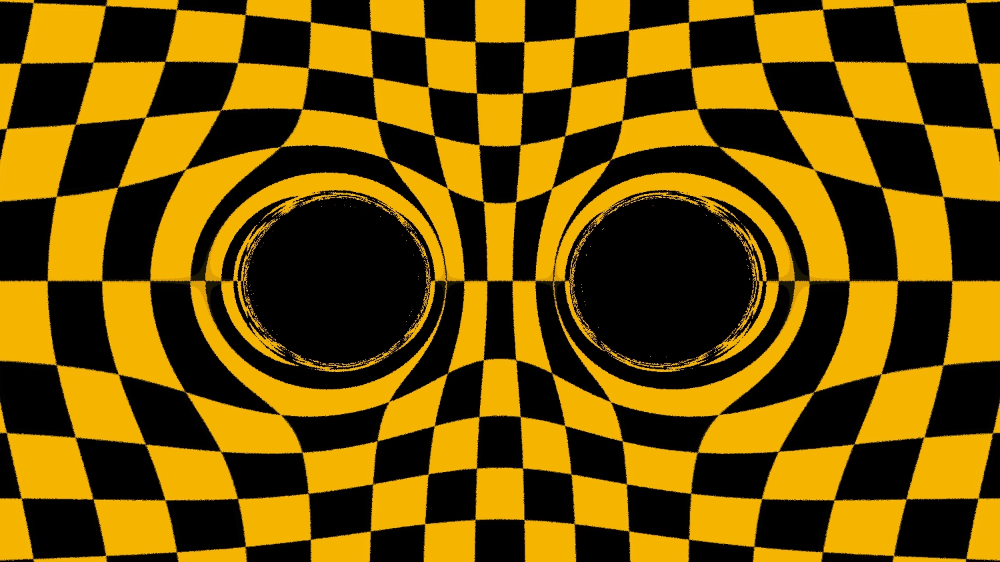

# Ray tracing Black Holes

This project is a parallel open-source implementation of a *ray-tracer* in the presence of *black hole geometry*.
The implementation uses a few different techniques usually present in parallel scientific computing,
such as, mathematical approximations, utilization of scientific libraries, shared-memory and distributed-memory parallelism.

## Dual Black Hole Extension

This project extends Liam's original single black hole ray tracer to support **dual black hole** configurations.
The main modifications are described below.

### Key Modifications

#### 1. Coordinate System: Polar -> Cartesian

The original implementation used **polar coordinates** (spherical coordinates) which are well-suited for single black hole calculations. For dual black holes, we switched to **Cartesian coordinates** to facilitate multi-body gravitational calculations.

**code example:**

```cpp
// src/solve.cc - Multi-black hole mode uses Cartesian coordinates
static int multi_func(double t, const double y[], double f[], void *params) {
    point3 pos(y[0], y[1], y[2]);  // Cartesian position
    vec3 vel(y[3], y[4], y[5]);    // Cartesian velocity
    vec3 accel(0, 0, 0);
    
    for (const auto &bh : *p->holes) {
        vec3 rel = pos - bh.origin;  // Direct Cartesian vector subtraction
        double dist = rel.length();
        // ... Newtonian gravity calculation
    }
}
```

In contrast, the single black hole mode still uses polar coordinates:

```cpp
// src/solve.cc - Single black hole mode uses polar coordinates
point3 pos = m_r.at(0);
spher3 s_next_pos = next_pos.to_spher3();  // Convert to spherical
new_phi = s_next_pos.z();  // Use azimuthal angle φ
```

#### 2. Physics Model: Schwarzschild -> Newton + Schwarzschild Fusion

The original implementation used the **Schwarzschild metric** for single black hole calculations. However, Schwarzschild solutions are only valid for single black holes. For dual black holes, we implemented a **hybrid approach**:

- **Far field**: Pure Newtonian gravity + GSL adaptive solver
- **Near field**: Newtonian gravity + weak-field Schwarzschild correction + RK4 manual integration
- **Adaptive switching**: Automatically selects method based on distance

**code example:**

```cpp
// src/solve.cc - Adaptive method selection
double schwarz_threshold_factor = (max_rs < 10.0) ? 5.0 : (10.0 / max_rs * 5.0);

for (const auto &bh : holes) {
    double dist = (pos - bh.origin).length();
    if (dist < schwarz_threshold_factor * bh.rs) {
        // Apply Schwarzschild correction: a_schwarz ≈ a_newton * (1 + 3*rs/r)
        double correction = 1.0 + 3.0 * bh.rs / dist;
        schwarz_correction_factor *= correction;
        use_schwarz_correction = true;
    }
}

if (use_schwarz_correction) {
    // Use RK4 method for better accuracy in strong field region
    // ... RK4 integration with corrected acceleration
} else {
    // Use Newtonian method with GSL solver
    gsl_odeiv2_driver_apply(m_d, &m_t, new_t, m_state);
}
```

The mode selection is determined at runtime:

```cpp
// src/camera.cc - Mode selection based on black hole count
ray_iterator ri = (black_holes.size() == 1) 
    ? ray_iterator(black_holes[0].mass, r, black_holes[0].origin, epsilon, true, false)
    : ray_iterator(black_holes, r, epsilon, true, false);
```

### Advantages

1. **Adaptive**: Automatically selects the appropriate method based on distance from black holes
2. **Efficient**: Fast Newtonian method in far field, precise RK4 integration in near field
3. **Physically reasonable**: Applies relativistic corrections in weak-field regions where they matter most

### Limitations

1. **Not a full relativistic solution**: This is a weak-field approximation, not a complete general relativity solution
2. **Static black holes**: Does not account for orbital motion or dynamic interactions
3. **Limited correction range**: Schwarzschild corrections are only applied within approximately r < 5*rs

### Summary

The dual black hole calculation uses a **"Newtonian gravity + weak-field Schwarzschild correction"** hybrid method:

- **Far field**: Pure Newtonian gravity + GSL adaptive solver
- **Near field**: Weak-field correction + RK4 manual integration  
- **Adaptive switching**: Automatically selects method based on distance

This is a practical engineering approximation that balances computational efficiency with physical accuracy.

---

## Installation

### Requirements

- Need a recent boost version. Version 1.86.0 was chosen for the project. Later (and some earlier) versions are likely to work, but require you to change CMakeLists.txt. We tried compiling with some 1.7* versions, but were not able to compile GIL. Only boost headers are required, specifically GIL.

- `source scripts/niagarasetup` on [SciNet's Niagara supercomputer](https://docs.scinet.utoronto.ca/index.php/Niagara_Quickstart)
- `source scripts/teachsetup` on [SciNet's Teach cluster](https://docs.scinet.utoronto.ca/index.php/Teach)
- See these scripts for the versions of libraries required and tested on.

### Building

A sample Makefile is provided to build across multiple different build styles. Support exists for MPI, OpenMP, or a hybrid of the two. Support additionally exists for Release builds, and Debug builds.

#### Manual build steps

- See `scripts/niagarasetup` or `scripts/teachsetup` for the versions of libraries required.
- `mkdir release && cd release && cmake -DENABLE_OPENMP=True -DENABLE_MPI=True -DCMAKE_BUILD_TYPE=Release ..`
- `make`

#### Finding Boost

Since your system might not necessarily come with a convenient boost location, our `Makefile` has a sample BOOST_ROOT parameter which helps you point CMake at the correct boost location. If your system has boost installed, this parameter can be removed.

### Custom Builds

When `make` is run in the top level directory, 3 targets are built:

- `debug`, the default build
- `openmp`, an openmp only build (equivalent to do `cmake -DCMAKE_BUILD_TYPE=Release -DENABLE_MPI=False -DENABLE_OPENMP=True`)
- `release`, openmp+mpi (equivalent to do `cmake -DCMAKE_BUILD_TYPE=Release -DENABLE_MPI=True -DENABLE_OPENMP=True`)

A manual build (without the top level makefile) is also possible by doing:

```
mkdir mpi && cd mpi
cmake -DCMAKE_BUILD_TYPE=Release -DENABLE_MPI=True -DENABLE_OPENMP=False ..
... lots of cmake output ...

make

... lots of make output...

./main # Note: You do NOT! need to supply any arguments, the program is coded with a default scene for easy demoing
> img.jpg is output

mpirun -np 4 ./main
```

### Profiling

You can optionally enable MPI in addition to this command.

`cmake -DENABLE_OPENMP=True -DENABLE_PROF=True -DCMAKE_BUILD_TYPE=Release`

## Running

You can run `./main -h` for an updated list of help options after building.

```
  -i <img_name>:
    default ../data/squares.jpg
  -b <black hole loc>
    default -400
  -B <background loc>
    default -500
  -M <mass>
    default 10
  -e <epsilon>
    default 5
  -W <width>
    default 400
  -d
    set debug, default false
  -c <cores>
    use <cores> for multiprocessing.
  -S
    wait for GDB to attach before initializing mpi..
  -s <number of samples>
    default 1
```

After building with MPI, you can run the binary using `mpirun -np NP ./main <options>`, where `NP` represents the *number of processes* to use.
When supplying `-np` to `mpirun`, this controls the number of MPI worker processes. When supplying `-c` to `./main`, this controls the number of *OMP threads*.
These options work concurrently when built with OpenMP and MPI support.
For instance, the following command will run the code in 2 processes and 40 threats each:

```
./main -1 -b -200 -M 10 -e 2 -W 1500 -i ./data/squares.jpg
./main -b -200 -p 200 -M 2 -e 2 -W 1500 -i ./data/squares.jpg
```

Thr original image and resulting one from executing the previous command, for reference are shown bellow:




### Examples

As for how to create the actual images themselves, they were done with pretty high settings:

```
make
... a lot of build output...

cd release
~/BHRaytracer/release/main -i ~/STScI-H-CANDELS_UDF-16300x9000.jpg -B -1000 -s 10 -W 2700
>output is img.jpg

./main -i ../eagle.jpg -s 10 -W 2700
>output is img.jpg
```

## Documentation

Documentation can be generated using `doxygen`
